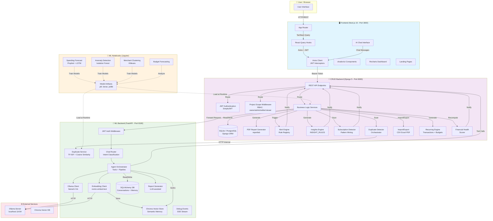

# WealthWise


> Personal finance management platform — track accounts, transactions, budgets, and goals; surface intelligent insights, detect subscriptions, monitor financial health, and interact with AI-powered assistants.

---

## Overview

WealthWise is a full-stack personal finance management platform that helps users take control of their financial lives. It combines comprehensive CRUD operations for accounts, transactions, budgets, goals, and recurring rules with advanced AI/ML capabilities — including duplicate transaction detection, intelligent insights, subscription pattern-mining, an explainable financial health score, and conversational AI assistants powered by Ollama.

The application is designed as a monolithic system composed of three primary services: a Next.js frontend, a Django CRUD backend, and a separate FastAPI ML backend for AI/ML workloads, with supporting Jupyter notebooks for experimentation and model training.

---

## Key Features

- **Authentication & Authorization** — JWT-based auth with refresh tokens, email-based registration
- **Multi-Project Workspaces** — Role-based access control (owner/admin/editor/viewer) per project
- **Accounts** — Bank accounts, credit/debit cards, wallets, and cash with balance tracking
- **Transactions** — Full CRUD with category, type, status, and date filtering; monthly summaries
- **Budgets** — Budget categories with spent tracking, progress visualization, and over-budget alerts
- **Goals** — Savings goals with progress tracking, contributions, target dates, and auto-completion
- **Recurring Transactions & Budgets** — Automated generation with pause/resume and lifecycle management
- **Financial Health Score** — Explainable 0–100 score from 10 weighted dimensions with recommendations
- **Dynamic Insights** — Rule-based, dismissible insight feed (spending spikes, savings opportunities, goal momentum)
- **Duplicate Detection** — ML-powered near-duplicate transaction detection at import time and via standing scan
- **Subscription Detection** — Pattern-mining engine that discovers hidden subscriptions from transaction history
- **AI Chat & Agents** — Conversational assistants for goals, budgets, insights, transaction search, and report generation
- **Reports** — PDF/CSV export, filtered analytics, and scheduled automated reports
- **Import/Export** — Bank-statement import with column mapping (CSV/Excel/PDF) and transaction export

---

## Tech Stack

### Frontend
| Category | Technology |
|----------|-----------|
| Framework | Next.js 15 (App Router) |
| UI Library | React 19 |
| Language | TypeScript 5 |
| Styling | Tailwind CSS |
| Components | shadcn/ui + Radix UI primitives |
| Icons | Lucide React |
| Charts | Recharts |
| Forms | React Hook Form + Zod |
| State | TanStack React Query (server state) |
| HTTP Client | Axios with JWT interceptors |
| Theme | next-themes |

### CRUD Backend
| Category | Technology |
|----------|-----------|
| Framework | Django 5 |
| API | Django REST Framework |
| Authentication | djangorestframework-simplejwt (JWT) |
| CORS | django-cors-headers |
| Filtering | django-filter |
| Database | SQLite (development) / PostgreSQL (production) |
| PDF Generation | reportlab |
| Testing | pytest + factory_boy + pytest-cov |

### ML Backend
| Category | Technology |
|----------|-----------|
| Framework | FastAPI |
| LLM Runtime | Ollama (llama3.2:1b, configurable) |
| Embeddings | Ollama (nomic-embed-text) |
| Vector Store | Chroma (for conversation memory) |
| ML | scikit-learn (TF-IDF, cosine similarity) |
| Database | SQLAlchemy + SQLite/PostgreSQL (conversation memory) |
| Testing | pytest |

### Notebooks
| Category | Technology |
|----------|-----------|
| Environment | Jupyter |
| ML/Stats | pandas, numpy, scikit-learn, Prophet, TensorFlow/Keras |
| Visualization | matplotlib, seaborn |

---

## Architecture



---

## Prerequisites

- **Python** 3.10 or higher
- **Node.js** 18 or higher
- **npm** (included with Node.js)
- **Ollama** — required for AI chat, agents, and LLM-powered features
  - Install from [ollama.com](https://ollama.com)
  - Pull required models: `ollama pull llama3.2:1b` and `ollama pull nomic-embed-text`
- **Git**

---

## Installation & Setup

### 1. CRUD Backend (Django)

```bash
cd Backend

# Create and activate virtual environment
python -m venv venv
# Windows:
venv\Scripts\activate
# macOS/Linux:
source venv/bin/activate

# Install dependencies
pip install -r requirements.txt

# Run migrations
python manage.py migrate

# (Optional) Seed demo data
python manage.py seed_data --years 3

# Start server
python manage.py runserver
```

The API will be available at `http://localhost:8000`.

### 2. ML Backend (FastAPI)

```bash
cd ML-Backend

# Create and activate virtual environment
python -m venv .venv
# Windows:
.venv\Scripts\activate
# macOS/Linux:
source .venv/bin/activate

# Install dependencies
pip install -r requirements.txt

# Start server
uvicorn app.main:app --host 0.0.0.0 --port 8100
```

The ML service will be available at `http://localhost:8100`.

### 3. Frontend (Next.js)

```bash
cd Frontend

# Install dependencies
npm install

# Start development server
npm run dev
```

The frontend will be available at `http://localhost:3000`.

### 4. Verify the Stack

- Frontend: http://localhost:3000
- CRUD Backend API: http://localhost:8000/api/
- ML Backend API: http://localhost:8100
- Health Check: `curl http://localhost:8000/api/health/`

---

## Running the Notebooks

The `ML-Notebooks/` directory contains Jupyter notebooks for data exploration, model training, and experimentation.

### Setup

```bash
# Create a dedicated environment for notebooks
python -m venv .venv
source .venv/bin/activate  # or .venv\Scripts\activate on Windows

# Install common data science dependencies
pip install jupyter pandas numpy scikit-learn matplotlib seaborn prophet tensorflow keras joblib
```

### Available Notebooks

| Notebook | Purpose |
|----------|---------|
| `Spending Forecast/` | Time-series forecasting (Prophet, LSTM) |
| `Transaction Anomaly Detection/` | Isolation Forest anomaly detection |
| `merchant clustering/` | KMeans merchant clustering |
| `budget-forecasting/` | Budget trend analysis and forecasting |

### Launch

```bash
cd ML-Notebooks
jupyter notebook
# or
jupyter lab
```

Open any `.ipynb` file in your browser. Notebooks are self-contained and include data loading, preprocessing, model training, and evaluation cells.

---

## Environment Variables / Configuration

### CRUD Backend (`Backend/.env`)

| Variable | Required | Default | Description |
|----------|----------|---------|-------------|
| `SECRET_KEY` | Yes | — | Django secret key |
| `DEBUG` | No | `True` | Enable debug mode |
| `ALLOWED_HOSTS` | No | `*` | Comma-separated allowed hosts |
| `DATABASE_URL` | No | `sqlite:///db.sqlite3` | Database connection string |
| `CORS_ALLOWED_ORIGINS` | No | `http://localhost:3000,http://localhost:3001,http://localhost:3002` | CORS origins |
| `ML_SERVICE_URL` | No | `http://localhost:8100` | ML backend URL |

### ML Backend (`ML-Backend/.env`)

| Variable | Required | Default | Description |
|----------|----------|---------|-------------|
| `DATABASE_URL` | No | `sqlite:///./data/ml_backend.db` | SQLAlchemy database URL |
| `OLLAMA_BASE_URL` | No | `http://localhost:11434` | Ollama server URL |
| `OLLAMA_CHAT_MODEL` | No | `llama3.2:1b` | Chat model name |
| `OLLAMA_EMBEDDING_MODEL` | No | `nomic-embed-text` | Embedding model name |

### Frontend (`Frontend/.env.local`)

| Variable | Required | Default | Description |
|----------|----------|---------|-------------|
| `NEXT_PUBLIC_API_URL` | No | `http://localhost:8000` | CRUD backend URL |
| `NEXT_PUBLIC_ML_API_URL` | No | `http://localhost:8100` | ML backend URL |

---

## API Documentation

### CRUD Backend

Full API documentation is available in [`Backend/docs/`](./Backend/docs).

Key endpoint groups:

- **Authentication**: `/api/auth/login/`, `/api/auth/refresh/`
- **Users**: `/api/users/`, `/api/users/me/`
- **Accounts**: `/api/accounts/`
- **Transactions**: `/api/transactions/`
- **Budgets**: `/api/budget-categories/`
- **Goals**: `/api/goals/`
- **Alerts**: `/api/alerts/`, `/api/alerts/generate/`
- **Reports**: `/api/reports/filter/`, `/api/reports/generate_pdf/`, `/api/reports/schedules/`
- **Duplicates**: `/api/duplicates/`, `/api/duplicates/scan/`
- **Insights**: `/api/insights/`
- **Subscriptions**: `/api/subscriptions/`
- **Financial Health**: `/api/financial-health/current/`, `/api/financial-health/report/`
- **Utilities**: `/api/health/`, `/api/seed-data/`

### ML Backend

Full documentation is available in [`ML-Backend/README.md`](./ML-Backend/README.md).

Key endpoint groups:

- **Duplicates**: `/duplicates/scan`, `/duplicates/score-batch`
- **Chat**: `/chat`, `/chat/stream`, `/chat/agent`
- **Reports**: `/reports/generate`, `/reports/explain`
- **Conversations**: `/conversations`
- **Memory**: `/user/memory`

---

## Usage

1. **Start all services** — ensure Django, FastAPI, and Next.js are running
2. **Register** — create an account at `http://localhost:3000/signup`
3. **Create a project** — default "Personal Finance" project is created on signup
4. **Add accounts** — link bank accounts, cards, or wallets
5. **Track transactions** — log income and expenses manually or via import
6. **Set budgets** — define budget categories with limits
7. **Create goals** — set savings targets with deadlines
8. **Review insights** — check the dashboard AI insights card for personalized recommendations
9. **Chat with AI** — use the chat interface for goal planning, budget advice, and transaction search
10. **Detect duplicates** — run a standing scan from the Duplicates page
11. **Generate reports** — export PDF/CSV reports or schedule automated delivery

---

## Testing

### CRUD Backend

```bash
cd Backend
venv\Scripts\activate

# Run full test suite with coverage
pytest

# Run specific test module
pytest api/tests/test_transactions.py

# Run with markers
pytest -m auth
pytest -m rbac -m project_isolation

# Generate HTML coverage report
pytest --cov=api --cov-report=html
```

### ML Backend

```bash
cd ML-Backend
.venv\Scripts\activate

# Run test suite
pytest tests
```

---

## Contributing

WealthWise is open to contributions. To contribute:

1. **Fork** the repository and create a feature branch from `main`
2. **Install** dependencies for the affected service(s)
3. **Make changes** — follow existing code style and conventions
4. **Add tests** for new functionality
5. **Run tests** — ensure the full suite passes
6. **Commit** with a clear, conventional commit message
7. **Push** and open a Pull Request describing the change, motivation, and any breaking changes

Please read `Backend/docs/testing.md` for backend testing conventions and guidelines.

---

## License

This project is licensed under the MIT License. See the [LICENSE](LICENSE) file for details.

---

## Contact & Acknowledgements

- **Repository**: [github.com/Harman8815/Wealth-wise](https://github.com/Harman8815/Wealth-wise)
- **Issues**: [GitHub Issues](https://github.com/Harman8815/Wealth-wise/issues)
- **Support**: support@wealthwise.com

WealthWise is built with Django, Next.js, FastAPI, and Ollama.
